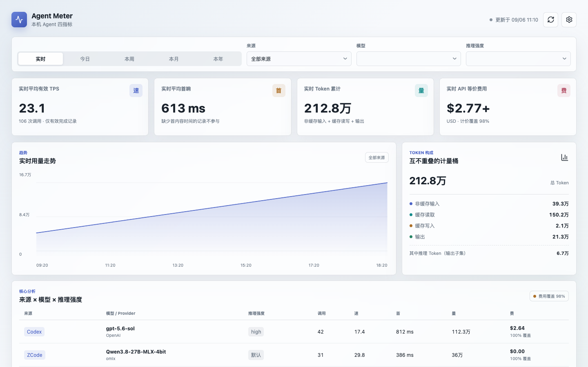

# Agent Meter

[](https://github.com/leoyoul/agent-meter/actions/workflows/ci.yml)
[](LICENSE)

Agent Meter 是一个本地优先的 macOS 菜单栏应用，用“速、首、量、费”观察 Codex、ZCode 和 OpenCode 的本机模型调用。

> Agent Meter 是社区维护的非官方工具，与 OpenAI、ZCode 或 OpenCode 无隶属或背书关系。



## 功能

- 菜单栏提供四个独立的 `38×22pt` 双行状态项，每项固定宽度并可单独开关；应用图标始终保留。
- 实时、今日、本周、本月和本年五个统一统计周期。
- 按来源、模型和推理强度查看有效 TPS、首响、Token 与 API 等价费用。
- Token 使用互不重叠的非缓存输入、缓存读取、缓存写入和输出计量桶；推理 Token 是输出子集。
- Codex 使用流式 JSONL 增量索引，ZCode 与 OpenCode 只读其 SQLite 数据库，不遍历整个应用目录。
- 支持暂停、断点续扫、数据源启停、重建 Codex 索引、登录启动和应用内稳定版更新。

## 指标口径

- `速`：`output_tokens / ((duration_ms - ttft_ms) / 1000)`。包含思考、工具等待和同一轮内多次模型调用，不代表服务端纯解码速度。
- `首`：开始到首个内容 Token 的时间。缺少首内容时间的历史记录不参与平均，不用总耗时代替。
- `量`：`非缓存输入 + 缓存读取 + 缓存写入 + 输出`。推理 Token 不重复计数。
- `费`：按调用日期对应的厂商官方标准文本 API 单价计算，使用整数 nano-USD 汇总。

实时周期取最近 10 个有效 observation：速和首取算术平均，量和费取累加值。其他周期以本机时区的自然日、周一、月初和年初为边界。

费用是 API 等价估算，不是 Codex 订阅、第三方套餐或实际账单。价目随应用版本发布，不在运行时抓取网页；未知价格不会按零处理，而是显示已知费用和计价覆盖率。当前目录的官方来源包括 [OpenAI 模型文档](https://developers.openai.com/api/docs/models/gpt-5.6-sol)、[MiniMax 按量价格](https://platform.minimax.io/docs/guides/pricing-paygo) 和 [DeepSeek 定价](https://api-docs.deepseek.com/quick_start/pricing)。

## 隐私边界

- 数据源只读；应用只写自己的 SQLite、设置和诊断日志。
- 不上传会话数据，不连接 Admin API、代理服务或任何统计后端。
- 不保存提示词、回复正文、工具参数或工具输出。
- 只计算标准文本 Token API 等价费用；图片、工具调用、订阅额度和汇率不纳入。

## 数据源

| 来源 | 只读位置 | 增量方式 |
| --- | --- | --- |
| Codex | `~/.codex/sessions`、`~/.codex/archived_sessions` | 文件偏移与监听 |
| ZCode | `~/.zcode/cli/db/db.sqlite` 的 `model_usage` | 最近调用重叠同步 |
| OpenCode | `~/.local/share/opencode/opencode.db` | `time_updated + id` 游标 |

应用不会扫描 ZCode 的完整目录，也不会重新读取已经迁移到统一 observation 层的 Codex 历史。

## 安装

从 [Releases](https://github.com/leoyoul/agent-meter/releases) 下载 Apple Silicon DMG。`v0.2.0` 起支持应用内更新。DMG 尚未经过 Apple Developer ID 签名或公证，macOS 可能阻止直接启动；对供应链安全有要求时，请审查源码并自行构建。

应用内更新包使用 Tauri 更新签名验证完整性。该签名不等同于 Apple Developer ID 签名或 Apple 公证。

## 从源码构建

需要 macOS 14+、Node.js 20+、Rust stable 和 Xcode Command Line Tools。

```bash
git clone https://github.com/leoyoul/agent-meter.git
cd agent-meter
npm ci
npm run desktop
```

运行检查和构建 ARM64 App/DMG：

```bash
npm test
npm run build
cargo test --manifest-path src-tauri/Cargo.toml
cargo clippy --manifest-path src-tauri/Cargo.toml --all-targets -- -D warnings
npm run tauri -- build --target aarch64-apple-darwin
```

浏览器开发模式使用脱敏模拟数据，默认地址为 `http://127.0.0.1:4319`。

## 参与贡献

请阅读 [CONTRIBUTING.md](CONTRIBUTING.md)。安全问题请按 [SECURITY.md](SECURITY.md) 私密报告。

## License

[MIT](LICENSE) © 2026 LeoY
